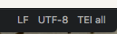

# atomic-tei

This is an Atom package providing a validating editing environment for documents conforming to a TEI P5 schema.  It is a fork of <https://github.com/aerhard/xml-demo-package>, configured to use TEI P5's "TEI all" `.rng` schema.

## Requirements

-  [Atom Editor](https://atom.io/), with [linter-autocomplete-jing](https://github.com/aerhard/linter-autocomplete-jing) installed.

## One-time setup

From a terminal in this directory, run

    apm link

NB: if you decide to move this folder, you'll have to rerun `apm link` from the new location.

## Usage

XML files with filename extension `.tei` will be validated against TEI P5's `tei_all.rng` schema as you edit.  You can use the template file in `xml/template.tei`.

You can also manually set *any* XML document to use the TEI-all schema.  One way is to click on the file-type setting at the bottom right of the Atom window. For example, if you start up a new `Plain text` document, click on the `Plain text` label, or if you a document opens as a generic `XML` type, click on `XML`, and then choose `TEI all` from the list of document types you're offered.  Another way to do this is to open the command palette (command-shift-p), and choose "Grammar selector: show" (control-shift-l), and choose `TEI all`.  Either way, you should then see the document type listed at the bottom right of your window as `TEI all`, like this:

## More information

The three directories `grammar`, `settings` and `teischemas` configure the Atom package.  If you want to modify settings (e.g., to configure different file extensions for validation with TEI), please see the documentation for the source package this is cloned from:  <https://github.com/aerhard/xml-demo-package>.
